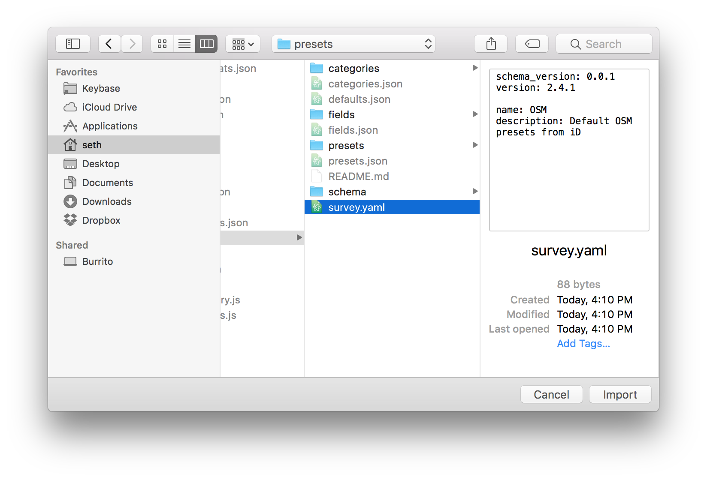

# Survey Definitions

Surveys consist of [iD](https://github.com/openstreetmap/id)-compatible presets
alongside a metadata file.

The simplest possible metadata file looks like this:

```yaml
schema_version: 0.0.1
version: 2.4.1

name: OSM
description: Default OSM presets from iD
```

If placed alongside iD's default presets in
[`data/presets`](https://github.com/openstreetmap/iD/tree/master/data/presets)
as `survey.yaml`, [Field Data
Coordinator](https://github.com/osmlab/field-data-coordinator/) can import it
and make all iD OSM presets available available as both recognized feature and
observation types.



Additional sample survey definitions are available in [`../data/surveys`](../data/surveys):

* `hfh_inspections` - building inspections for Habitat for Humanity
* `sri_lanka` - a Sri Lanka building survey

`hfh_inspections` does not contain any presets derived from iD, as none of the feature / observation types match what's contained in OSM (although OSM-style tagging is still used for observation metadata); each JSON file was hand-crafted (copy/pasted from others and adapted) to match the specific needs of that survey.

`sri_lanka` is derived from iD's presets--existing presets were copied from the
iD git repository and modified (tags added / removed and options added, e.g.
[`fields/building.json`](../data/surveys/sri_lanka/fields/building.json)).

Here's a simplified, annotated version of the Sri Lanka survey:

```yaml
# derived from
# https://wiki.openstreetmap.org/wiki/Sri_Lanka_Tagging_Guidelines#Building_Characteristics

# survey definition schema version (for compatible with future versions of
# tools)
schema_version: 0.0.1
# survey version
version: 0.0.1

# survey name
name: Sri Lanka Building Survey
# survey description
description: >
  Collection of exposure information for buildings in the flood-prone Attanagalu
  Oya river basin.

# feature types that observations can be attached to (currently: all named
# nodes)
feature_types:
  # unique id for this feature type (to be referenced from observation_types)
  #
  # if this is omitted, all presets present on the filesystem will be loaded,
  # using `<key>[=<value>]` as their id
  #
  # n.b. this is not included in the list of observation types (so new
  # observations can't be created as this type), as more specific building types
  # are available
  - id: building
    # preset path (maps to presets/building.json)
    preset: building

  # feature type id
  - id: amenity=place_of_worship
    # preset path (presets/amenity/place_of_worship.json)
    preset: amenity/place_of_worship

  # ...

# list of observation types (structured survey responses)
# this is a subset of feature_types, so each type can be referred to using a
# feature id
#
# if this is omitted, all feature types can be created as observations
observation_types:
  # feature type id
  - amenity=place_of_worship

  # ...

# survey metadata
meta:
  # person coordinating the survey
  coordinator: Robert Banick
  # organization coordinating the survey
  organization: GFDRR
```

Optional icons and categories
([`presets/categories/*.json`](https://github.com/openstreetmap/iD/tree/master/data/presets/categories))
can also be provided to group and illustrate presets.

The simplest way to create a new survey is to copy the preset files used by an
existing survey and to modify them to meet your needs. Barring that, iD presets
represent a good starting point.

## Command Line

[`observe-tools`](../tools) includes a pair of command line utilities for working with survey definitions:

* `compile-survey.js` - compiles a YAML survey definition + directory containing
  preset JSON files into a self-contained JSON survey definition (matching what
  would be created by Field Data Coordinator).
* `dump-survey.js` - output a JSON survey definition as Markdown.
